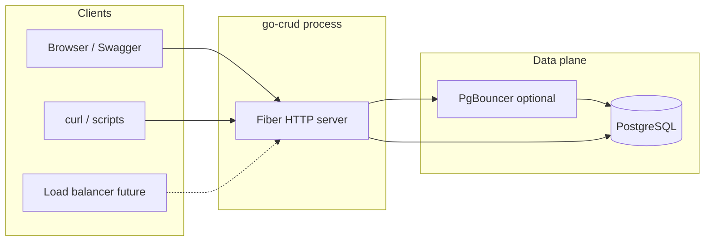
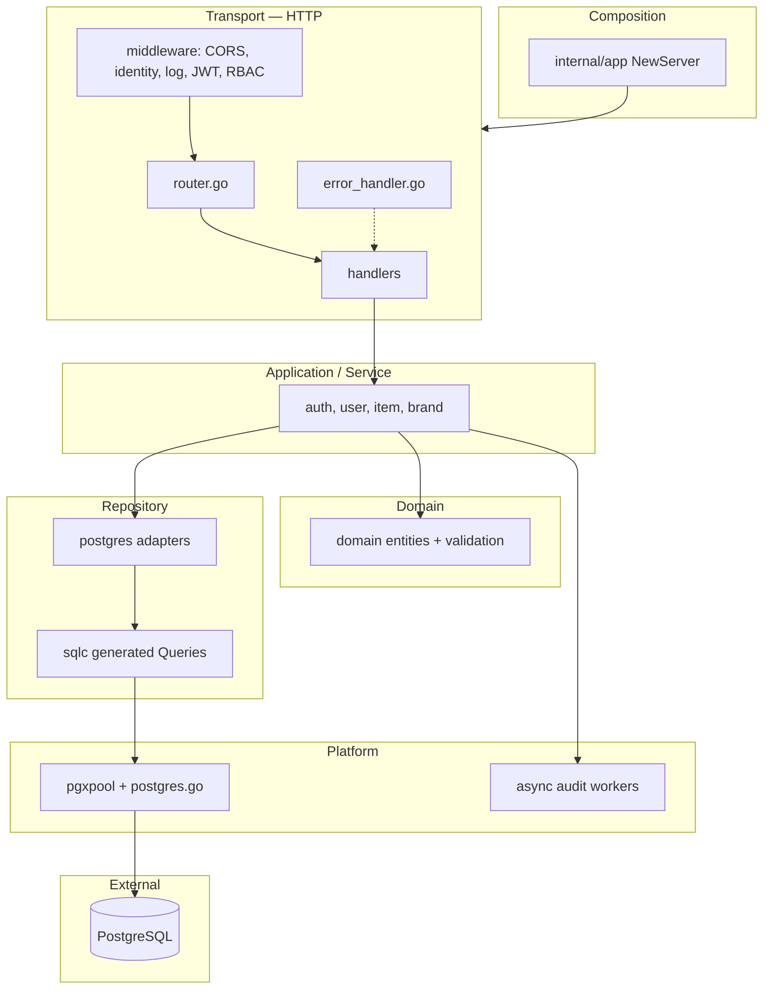
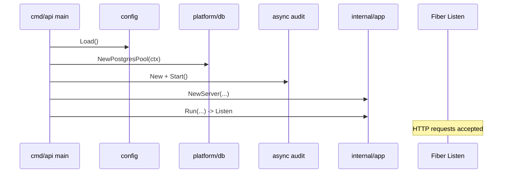
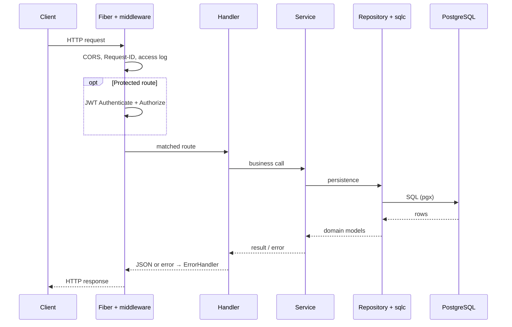
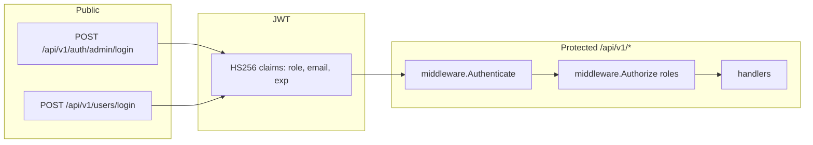

# Architecture — go-crud API (Fiber)

This document describes **system architecture**, **layers**, **data flow**, and **external dependencies**. For a file-by-file request walkthrough, see [`REQUEST_LIFECYCLE.md`](./REQUEST_LIFECYCLE.md).

---

## 1) One-liner

**Fiber HTTP API** → **JWT + RBAC** → **Service (business logic)** → **Repository** → **`sqlc` + pgxpool** → **PostgreSQL**.  
Also: **structured logging**, **async audit**, **health/readiness**, **embedded Swagger + OpenAPI**, **central Fiber `ErrorHandler`**.

---

## 2) System context



- Today clients talk directly to the API process.
- In production you typically add a **load balancer**, multiple replicas, **PgBouncer**, and PostgreSQL.

---

## 3) In-process layers

Rule: **upper layers depend on lower layers; lower layers do not know HTTP details**.



| Layer | Package / path | Responsibility |
|-------|----------------|----------------|
| **Composition** | `internal/app` | Wire dependencies, Fiber app, global middleware, `RegisterRoutes` / `RegisterSwaggerRoutes`, `Run` |
| **Transport** | `internal/transport/http` | Routes, handlers, middleware, **`ErrorHandler`**, Swagger |
| **Domain** | `internal/domain` | Entities + validation rules |
| **Service** | `internal/service` | Use cases after authentication/authorization concerns |
| **Repository** | `internal/repository/postgres` | Persistence; sqlc calls + domain mapping |
| **Platform** | `internal/platform` | DB pool, background audit workers |

---

## 4) Bootstrap sequence



Files: `cmd/api/main.go` → `internal/config`, `internal/platform/db`, `internal/platform/async`, `internal/app/app.go`.

---

## 5) Request path (summary)



More detail: [`REQUEST_LIFECYCLE.md`](./REQUEST_LIFECYCLE.md).

---

## 6) Authentication and authorization



- **Authenticate**: Parse `Authorization: Bearer`, validate JWT, attach claims to **`c.Locals`**.
- **Authorize**: Allow only listed roles (for example admin-only `POST /items`).

Code: `internal/service/auth_service.go`, `internal/transport/http/middleware/auth.go`.

---

## 7) Data and SQL (`sqlc`)


- **Migrations**: Apply real DDL to the database.
- **`sqlc`**: Compile-time SQL ↔ Go typing; it does **not** migrate the database. After SQL changes: **`make sqlc`** and apply migrations as needed.

---

## 8) Observability and operations

| Concern | Implementation |
|---------|------------------|
| Structured logs | `log/slog` JSON to stdout |
| Request correlation | `X-Request-ID` + `meta.request_id` in error JSON |
| Access log | `middleware/observability.go` per request |
| Liveness | `GET /healthz` |
| Readiness | `GET /readyz` (pool ping) |

Central error JSON: **`internal/transport/http/error_handler.go`** (registered in `fiber.Config{ ErrorHandler: ... }`).

---

## 9) Concurrency and background work

- **Audit logger**: Buffered channel + worker goroutines; **`Publish`** is non-blocking under load. **`Start`** / **`Stop`** (typically `defer` in `main`) coordinate shutdown and draining.  
File: `internal/platform/async/audit_logger.go`.

---

## 10) Configuration

- Values come from **environment variables**: `internal/config/config.go`.
- Local: **`.env`** (gitignored), template **`.env.example`**.
- Default **`HTTP_ADDR=:8080`**.

---

## 11) Development tooling

| Tool | Purpose |
|------|---------|
| `Makefile` | `run`, `watch`, `build`, `test`, `fmt`, `lint`, `migrate`, `sqlc` |
| `.golangci.yml` | golangci-lint rules |
| Air (`.air.toml`) | Rebuild/restart on file changes |

---

## 12) Scaling notes (high level)

- **Horizontal scale**: Multiple stateless API replicas; JWT avoids server-side sessions in the app.
- **DB**: Tune pool sizes; add **PgBouncer** in front of Postgres when needed.
- **Rate limiting / WAF**: Usually placed in front of the app (gateway, mesh, CDN).

---

## 13) Repository tree (architecture-relevant)

```text
cmd/api/                 # process entry
internal/
  app/                   # Fiber composition + Run (shutdown)
  config/                # env → typed config
  domain/                # entities + invariants
  service/               # auth, user, item, brand
  repository/postgres/   # adapters + sqlc wrapper
  repository/postgres/sqlc/  # generated (do not hand-edit)
  platform/db/           # pool + ping/retry
  platform/async/        # audit worker pool
  transport/http/        # routes, middleware, handlers, swagger, error_handler
  transport/response/    # success JSON envelope helpers
db/
  schema/                # sqlc schema input
  query/                 # sqlc queries
migrations/              # runtime DDL
```

---

## Related documentation

- [DOCS.md](./DOCS.md) — Full project guide  
- [REQUEST_LIFECYCLE.md](./REQUEST_LIFECYCLE.md) — Request lifecycle  
- [LEARNING_TOPICS.md](./LEARNING_TOPICS.md) — Learning topics and practice  
