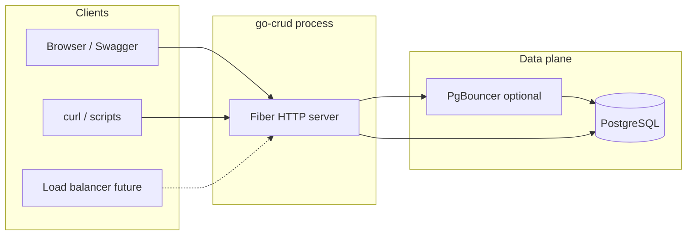
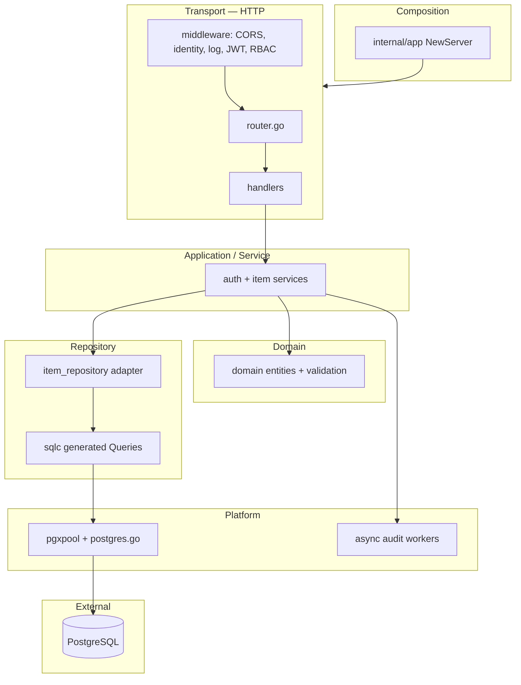
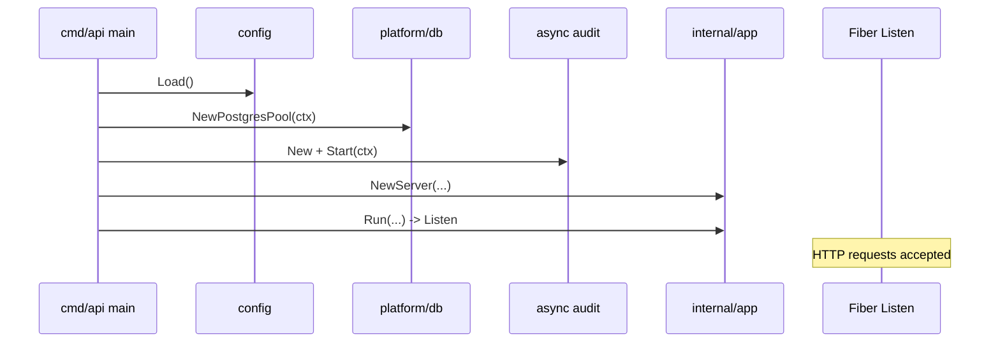
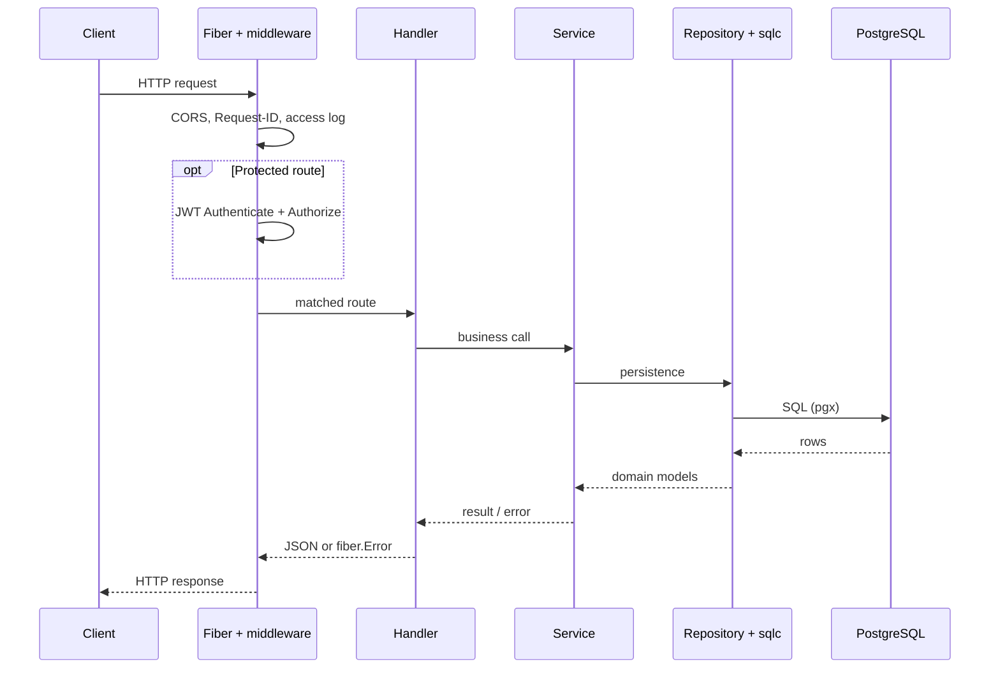
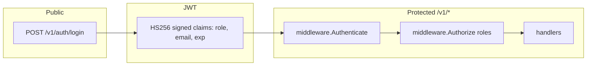
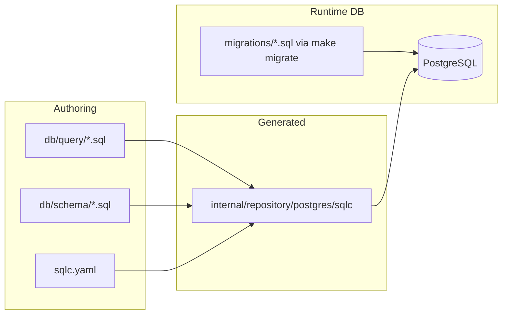

# Architecture — go-crud API

এই ডকুমেন্টে **সিস্টেম আর্কিটেকচার**, **লেয়ার**, **ডাটা ফ্লো**, এবং **বাইরের ডিপেন্ডেন্সি** বোঝানো হয়েছে। কোড পাথের বিস্তারিত ধাপ-ধাপ বর্ণনা: [`REQUEST_LIFECYCLE.md`](./REQUEST_LIFECYCLE.md)।

---

## 1) এক লাইনে

**Fiber HTTP API** → **JWT + RBAC** → **Service (ব্যবসায়িক লজিক)** → **Repository** → **`sqlc` + pgxpool** → **PostgreSQL**।  
পাশাপাশি: **স্ট্রাকচার্ড লগ**, **async audit**, **health/readiness**, **Swagger**।

---

## 2) সিস্টেম কনটেক্সট (কে কার সাথে কথা বলে)



- বর্তমানে ক্লায়েন্ট সরাসরি API প্রসেসে হিট করে।
- প্রোডাকশনে সাধারণত **লোড ব্যালান্সার** + একাধিক API ইনস্ট্যান্স + **PgBouncer** + PostgreSQL।

---

## 3) প্রসেস ভিতরের লেয়ার (hex / layered view)

নিচের নিয়ম: **উপরের লেয়ার নিচের লেয়ারকে চেনে; নিচের লেয়ার উপরের HTTP জানে না**।



| লেয়ার | প্যাকেজ / পাথ | দায়িত্ব |
|--------|----------------|----------|
| **Composition** | `internal/app` | সব ডিপেন্ডেন্সি wire-up, Fiber + global middleware |
| **Transport** | `internal/transport/http` | রাউট, হ্যান্ডলার, HTTP-specific এরর/স্ট্যাটাস |
| **Domain** | `internal/domain` | এন্টিটি + ইনভেরিয়েন্ট (যেমন validation) |
| **Service** | `internal/service` | use-case, RBAC-পরবর্তী বিজনেস লজিক |
| **Repository** | `internal/repository/postgres` | DB অ্যাক্সেস; `sqlc` কল + ডোমেইনে ম্যাপ |
| **Platform** | `internal/platform` | পুল, ব্যাকগ্রাউন্ড ওয়ার্কার |

---

## 4) বুটস্ট্র্যাপ সিকোয়েন্স (প্রসেস স্টার্ট)



ফাইল: `cmd/api/main.go` → `internal/config`, `internal/platform/db`, `internal/platform/async`, `internal/app/app.go`।

---

## 5) রিকোয়েস্ট পাথ (সংক্ষেপ)



বিস্তারিত টেবিল: [`REQUEST_LIFECYCLE.md`](./REQUEST_LIFECYCLE.md)।

---

## 6) অথেন্টিকেশন ও অথরাইজেশন



- **Authenticate**: টোকেন বৈধ কিনা, claims `c.Locals` এ সেট।
- **Authorize**: রোল allowlist (admin-only `POST /items`, ইত্যাদি)।

কোড: `internal/service/auth_service.go`, `internal/transport/http/middleware/auth.go`।

---

## 7) ডাটা ও SQL (`sqlc`)



- **মাইগ্রেশন**: রিয়েল ডাটাবেজ স্কিমা তৈরি/আপডেট।
- **`sqlc`**: কম্পাইল-টাইমে SQL ↔ Go টাইপ মিল রাখে; রানটাইমে স্কিমা অটো অ্যাপ্লাই করে না।  
চেঞ্জ করলে: `make sqlc` (জেনারেট) + `make migrate` (DB) — উভয়ই মাথায় রাখা।

---

## 8) অবজারভেবিলিটি ও অপারেশন

| Concern | Implementation |
|---------|------------------|
| Structured logs | `log/slog` JSON to stdout |
| Request correlation | `X-Request-ID` + `request_id` in error JSON |
| Access log | `middleware/observability.go` per request |
| Liveness | `GET /healthz` |
| Readiness (DB) | `GET /readyz` pings pool |

কেন্দ্রীয় এরর রেসপন্স: `internal/transport/http/error_handler.go`।

---

## 9) কনকারেন্সি ও ব্যাকগ্রাউন্ড

- **Audit logger**: বাফার্ড চ্যানেল + একাধিক goroutine worker; `Publish` ননব্লকিং (চাপে ড্রপ)।  
ফাইল: `internal/platform/async/audit_logger.go`।

---

## 10) কনফিগারেশন

- সব গুরুত্বপূর্ণ মান **environment** থেকে: `internal/config/config.go`।  
- লোকাল ডেভ: `.env` (gitignored), টেমপ্লেট: `.env.example`।

---

## 11) ডেভেলপমেন্ট ও বিল্ড টুলিং

| Tool | Purpose |
|------|---------|
| `Makefile` | `run`, `watch`, `build`, `test`, `migrate`, `sqlc` |
| Air (`.air.toml`) | ফাইল চেঞ্জে auto rebuild/restart |

---

## 12) স্কেলিং ও প্রোডাকশন নোট (হাই লেভেল)

- **Horizontal scale**: একাধিক API রেপ্লিকা; stateless JWT তাই সেশন স্টোর লাগে না।
- **DB**: `pgxpool` max/min কানেকশন টিউন; সামনে PgBouncer।
- **Rate limiting / WAF**: এখনো অ্যাপে নেই — প্রোডাকশন গেটওয়ে বা সার্ভিস মেশে যোগ করা যায়।
- **সিক্রেট**: JWT secret env; ইউজার পাসওয়ার্ড বর্তমানে env ডেমো স্টাইল — পরবর্তী উন্নতি: DB + bcrypt।

---

## 13) রিপোজিটরি ট্রি (আর্কিটেকচার-relevant)

```text
cmd/api/                 # process entry
internal/
  app/                   # composition root (Fiber + deps)
  config/                # env → typed config
  domain/                # entities + invariants
  service/               # use-cases (auth, items)
  repository/postgres/   # adapters + sqlc wrapper
  repository/postgres/sqlc/  # generated (do not hand-edit)
  platform/db/           # pool + ping/retry
  platform/async/      # audit worker pool
  transport/http/      # routes, middleware, handlers, swagger
db/
  schema/              # sqlc schema input
  query/               # sqlc queries
migrations/            # runtime DDL for DB
```

---

## Related documentation

- [DOCS.md](./DOCS.md) — পূর্ণ প্রজেক্ট গাইড  
- [REQUEST_LIFECYCLE.md](./REQUEST_LIFECYCLE.md) — রিকোয়েস্ট লাইফসাইকেল  
- [LEARNING_TOPICS.md](./LEARNING_TOPICS.md) — শেখার টপিক ও প্র্যাকটিস  
